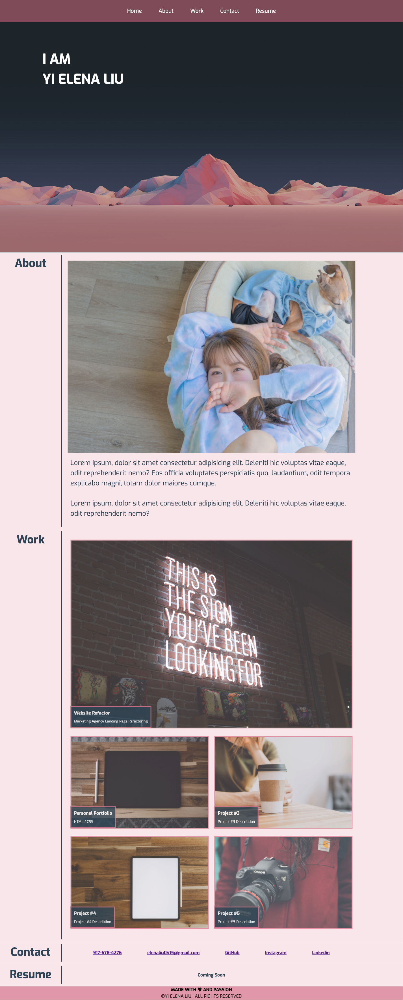
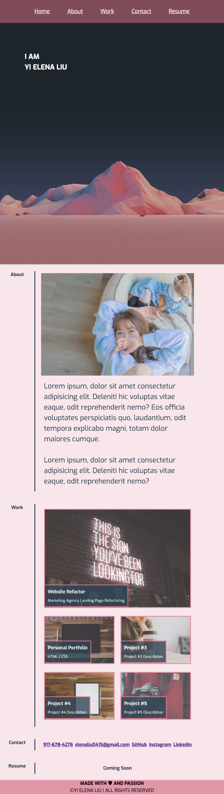
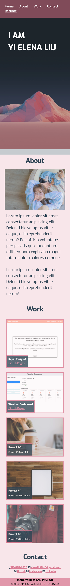

# Personal Portfolio Webpage

## Description

This is my first personal portfolio page for employers to get to know me. It has five sections:

- Home: The first view of the page containing a background picture and a navigation bar
- About: A recent photo of me and personal introduction
- Work: The gallary to showcase my major projects and brief description of the project 
- Contact: My contact information 
- Resume: A resume to download (working progress)

## Screenshot for my portfolio website

### Desktop Screen 

### Tablet Screen 

### Mobile Screen 

